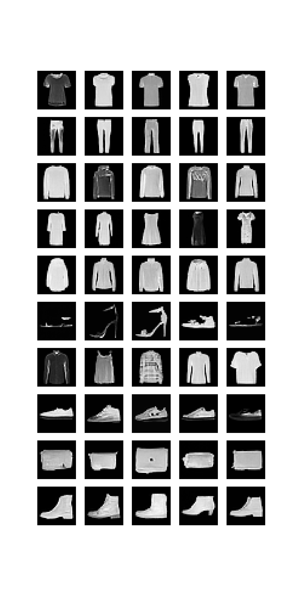

# Generative-Models-FashionMNIST
In this project (Done as part of CMPUT 328 project), I implemented and evaluated several popular generative models, including Variational Autoencoders (**VAE**), Denoising Diffusion Probabilistic Models (**DDPM**), Denoising Diffusion Implicit Models (**DDIM**), and Latent Diffusion Models (**LDDPM**). The goal was to implement class-conditional generative models using the FashionMNIST dataset, where each model generates samples based on the specified class label.

---

### **Overview of Implementation**

In this project, I implemented several **class-conditional generative models** on the FashionMNIST dataset, with a focus on generating 32x32 class-conditional samples. The models implemented include:
 
1. **Conditional DDPM (Denoising Diffusion Probabilistic Models)**
2. **DDIM (Denoising Diffusion Implicit Models)**
3. **VAE (Variational Autoencoders)**
4. **LDDPM (Latent Denoising Diffusion Probabilistic Models)**

The models follow a general process of training with the FashionMNIST dataset (after padding to 32x32 images) to generate class-conditional samples. Each of the models leverages a unique approach to learning and generating samples.

#### FashionMNIST 
 
---

### **Key Components**

#### **1. SinusoidalPositionEmbeddings**
- **Purpose**: Generates sinusoidal positional encodings based on the time step.
- **Usage**: These embeddings are crucial for encoding time steps during the diffusion process in both DDPM and DDIM models, ensuring that time-dependent transformations can be learned effectively.

#### **2. UNet**
- **Purpose**: A U-Net architecture used for noise estimation in the diffusion models.
- **Usage**: The UNet model receives noisy images, time steps, and class labels as input and outputs the predicted noise level. This architecture is used in both **DDPM** and **DDIM** for the core denoising process.

#### **3. VarianceScheduler**
- **Purpose**: Defines how noise is added during the diffusion process.
- **Usage**: The scheduler controls the rate at which noise is introduced to the image during the forward diffusion process. It uses linear or quadratic interpolation between the start and end noise levels (β1 and β2) and provides this information for both **DDPM** and **DDIM**.

#### **4. DDPM (Denoising Diffusion Probabilistic Models)**
- **Core Functionality**:
  - **Forward Process**: Adds noise to images through multiple steps, conditioned on the input labels.
  - **Noise Estimation**: Utilizes the UNet to estimate the noise added at each step.
  - **Sample Recovery**: Recovers clean images by iterating backward through the diffusion process.
  - **Sample Generation**: Generates new samples iteratively from pure noise, conditioned on class labels.
  
  **Conditional DDPM** generates class-conditional samples, meaning you can specify which class the model should generate images for.

#### **5. DDIM (Denoising Diffusion Implicit Models)**
- **Core Functionality**:
  - **Forward Process**: Similar to DDPM but with a more implicit approach to the backward process.
  - **Noise Estimation**: DDIM relies on estimating the noise at each diffusion step and offers improved sample generation efficiency compared to DDPM.
  - **Sample Generation**: Unlike DDPM, DDIM can generate samples without the need to go through all the steps of the diffusion process, allowing for faster generation of high-quality samples.
  - **Class-Conditional Sampling**: Allows for the generation of images conditioned on specific class labels.

#### **6. VAE (Variational Autoencoders)**
- **Core Functionality**:
  - **Encoder**: Maps the input image to a latent space using a probabilistic encoder.
  - **Decoder**: Generates samples by sampling from the latent space and passing the samples through a decoder.
  - **Class-Conditional VAE**: This version of VAE conditions both the encoder and decoder on the class label to generate class-specific images.
  - **Training**: Optimized using a variational lower bound loss, combining reconstruction and regularization terms to ensure the latent space is well-structured for generative purposes.

#### **7. LDDPM (Latent Denoising Diffusion Probabilistic Models)**
- **Core Functionality**:
  - **Latent Diffusion Process**: Instead of directly applying the diffusion process to the image space, LDDPM operates in a lower-dimensional latent space learned by a pre-trained VAE.
  - **Noise Estimation**: The model estimates noise in the latent space, which is then decoded back into the image space.
  - **Class-Conditional Sampling**: This method allows for the generation of class-specific samples from the latent space, providing a more efficient generative process.
  - **Training**: LDDPM leverages the VAE to reduce the dimensionality of the problem, leading to faster and more efficient training and generation.

---

### **Training Process**
The models were trained with the following steps:

- **Image Preprocessing**: The FashionMNIST images were padded to a size of 32x32 to facilitate better down-sampling during the training process.
- **Class-Conditional Generation**: Each model was modified to accept class labels as inputs, ensuring that the generated samples belong to the specified classes.
- **Loss Functions**: Different models used appropriate loss functions (e.g., reconstruction loss for VAE, L1/L2 loss for DDPM, and DDIM) to guide the training process.
- **Optimization**: Adaptive Moment Estimation (Adam) was used for optimizing the parameters, ensuring convergence during training.

---

### **Model Evaluation**
After training, the models were evaluated by generating new class-conditional samples from random noise. The generated images were analyzed to assess their quality and class-specific features.

Each of the generative models was tested on their ability to generate images corresponding to a specific class label, demonstrating the class-conditional capabilities of DDPM, DDIM, VAE, and LDDPM.
---

### **Results**
#### Results of DDPM Model  
  

#### Results of DDIM Model
  

#### Results of VAE Model
  
